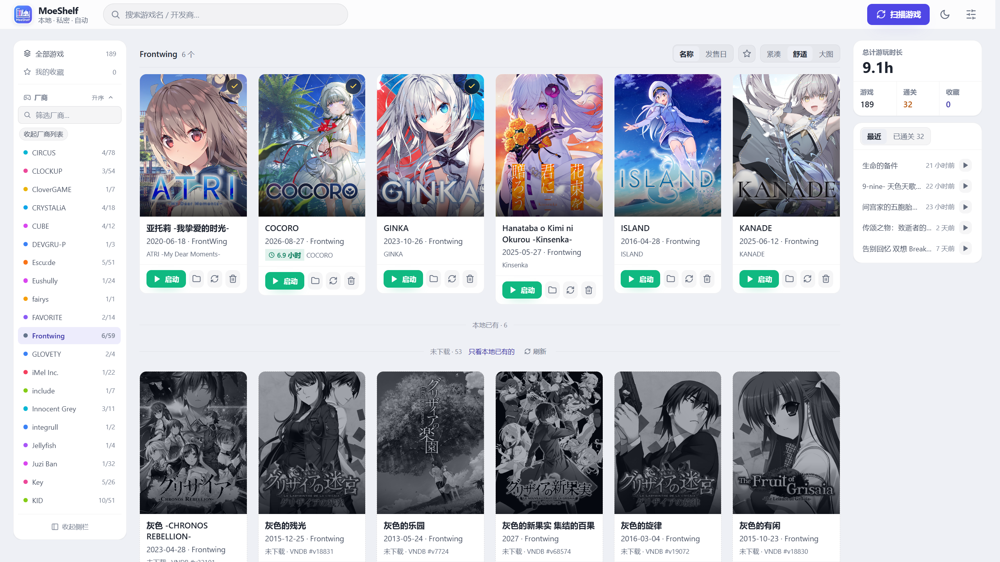

[](https://deepseek.com)
[](https://github.com/RoxyGreyrat/MoeShelf/releases)
[](LICENSE)
[](#环境要求)
[](#5-分钟上手)

<p align="center">
  
</p>

<h1 align="center">MoeShelf</h1>

<p align="center">
  本地 Galgame 收藏管理工具 · 支持把游戏画面串流到手机
</p>

<div align="center">

自动扫描 · 多源刮削 · 中文信息 · 游玩记录 · 局域网访问 · **手机串流**

**[下载最新版](https://github.com/RoxyGreyrat/MoeShelf/releases/latest)** ·
**[使用教程](docs/使用教程.md)** ·
[更新日志](更新日志.md) ·
[反馈问题](https://github.com/RoxyGreyrat/MoeShelf/issues)

当前版本：`v2.0.0`

---

</div>

<p align="center">
  
</p>

---

## 目录

- [5 分钟上手](#5-分钟上手)
- [手机串流（2.0.0 新增）](#手机串流200-新增)
- [功能总览](#功能总览)
- [从源码运行](#从源码运行)
- [桌面版 exe](#桌面版-exe)
- [数据与隐私](#数据与隐私)
- [数据源说明](#数据源说明)
- [已知问题](#已知问题)
- [常见问题 FAQ](#常见问题-faq)
- [项目结构](#项目结构)
- [致谢](#致谢)
- [免责声明](#免责声明)
- [许可证](#许可证)

---

## 5 分钟上手

### 1. 下载与解压

到 [Releases](https://github.com/RoxyGreyrat/MoeShelf/releases/latest) 下载
`Moeshelf-<版本>-windows-x64.zip`，解压到一个固定的短路径，例如 `D:\MoeShelf\`。

压缩包里**已包含全部依赖**（含手机串流所需的采集端），不需要 `npm install`。

### 2. 前提：电脑上要有 Node.js（20 或更高）

MoeShelf 是「浏览器界面 + 本机 Node 服务端」的结构，**Node.js 是唯一的外部依赖，没有它程序起不来**。

```bat
node -v
```

- 打印 `v20.x` / `v22.x` / `v24.x` 之类 → 已就绪，跳到第 3 步
- 提示「不是内部或外部命令」或版本低于 20 → 去 <https://nodejs.org/zh-cn> 下载 **LTS 的 Windows 安装包 (.msi)**，一路下一步（**保持勾选 `Add to PATH`**），装完**重开一个命令行窗口**再验证

> **电脑上没有运行环境、公司电脑不给装软件、没有管理员权限** —— 都有对应做法：
> 见 [使用教程 · 第 1 章](docs/使用教程.md#第-1-章--电脑上没有-node-运行环境怎么办重点)（含免安装 zip 版 Node 的配法与常见坑）。

### 3. 启动

双击 **`启动.bat`**（或 `MoeShelf.exe`），会弹出一个黑色命令行窗口并自动打开浏览器：

```text
URL: http://localhost:3000
Phone access (same WiFi): http://192.168.1.64:3000
Press Ctrl+C to stop the server
```

> ⚠️ **黑窗口 = 程序本身，别关它。** 关掉窗口浏览器页面就打不开了；想再次使用重新双击 `启动.bat`。
> 3000 端口被占用时会自动改用 3001~3019，**以黑窗口打印的 URL 为准**。

### 4. 扫描游戏

点顶栏设置图标 → 在「**游戏根目录**」里选择你的游戏目录 → **保存并扫描**。

MoeShelf 把该目录下的**每个一级子文件夹**当作一个游戏：

```text
D:\Galgame\                 ← 把这个目录填进设置
├── 9-nine-新章\             ← 一个游戏（自动识别主程序 exe）
├── 夏日口袋REFLECTION BLUE\  ← 一个游戏
└── ...
```

扫描完成后卡片会自动向 VNDB / Bangumi / YMgal / CnGal / Moyu 刮削封面与中文信息。

### 5. 手机访问与手机串流

1. 电脑上**右键 `开启局域网访问.bat` → 以管理员身份运行**（放行端口与串流所需 UDP）
2. 手机连**同一 Wi-Fi**，浏览器打开黑窗口里 `Phone access (same WiFi):` 那行地址
3. 手机点游戏的「**启动**」→ 电脑自动开游戏并把**游戏窗口画面 + 系统声音**推到手机（不用装任何 App）

**更多细节**（首次启动、刮削与手动修正、换封面、通关标记、手机访问、数据迁移、故障排查）
→ **[详细使用教程](docs/使用教程.md)**

---

## 手机串流（2.0.0 新增）

**手机上点「启动」，电脑自动把游戏窗口画面与声音推到手机。** 电脑端的「启动」保持原样（只启动、不串流）。

| 能力 | 说明 |
| --- | --- |
| 只串游戏窗口 | 桌面不入镜；窗口比例**原样保留**（16:9 / 4:3 / 其他），手机端绝不拉伸 |
| 系统声音 | 走 Windows 回环音频，游戏 BGM 与语音都会传过去 |
| 零点击采集 | 采集端自动定位该游戏的窗口（支持「启动器 → 引擎主程序」这类引擎，如 BGI / Ethornell） |
| 自动置顶 | 手机操作期间自动把游戏窗口提到前台并置顶（否则注入的点击会被别的窗口收走），停止操作后自动还原 |
| 手机操作 | 单击 = 左键、长按 = 右键、拖动 = 移动鼠标、双指上下滑 = 滚轮；另有屏幕键盘 / 全屏 / 声音 / 重连 |
| 结束游戏 | 手机可直接「结束游戏」（结束电脑上该游戏并回到游戏库）或「返回游戏库」 |
| 自动重连 | 手机退出重进自动恢复会话 |
| **画质 / 音质可调** | 设置 → 网络 → **手机串流**：视频码率（**0 = 不限制**）、缩放宽度、画面优化方向、保分辨率 / 保帧率、帧率、音频码率与类型、关闭语音处理、优先 H.264；并提供「清晰优先 / 音质优先 / 均衡 / 流畅优先」四个预设 |
| iPad / Safari | 默认优先 H.264（Safari 不支持 VP9），可在设置里关闭 |

**音画取舍提示**：视频与音频挤占同一条链路带宽 —— **音质变差最常见的原因就是视频码率占满带宽**；设置页的「音质优先」预设会自动把视频降到 10 Mbps、音频抬到 320 kbps。

**采集端说明**：串流由内置的 Electron 采集端完成（「零点击锁定指定窗口 + 拿到窗口声音」在 Windows 上唯一可行的方案）。因此发布包比早期版本大约 250–300 MB（压缩后）。

→ 完整说明与排错见 **[使用教程第 12 章](docs/使用教程.md#第-12-章--手机串流把游戏画面推到手机)**

---

## 功能总览

### 本地收藏

* 自动扫描游戏目录，识别文件夹与可执行文件
* 智能选择主程序，自动排除安装程序、卸载器、运行库等无关文件
* 收藏、置顶、**已通关**标记（已通关卡片右上角显示金色折角缎带）
* 按通关时间查看；自动统计游玩时长（启动游戏后自动累计）
* 三档卡片密度（紧凑 / 舒适 / 大图）、搜索与厂商筛选

### 多源自动刮削

支持 **VNDB、Bangumi、YMgal、CnGal、Moyu** 五个数据源（各自提供什么见[数据源说明](#数据源说明)）。
支持全源并行搜索、相似度校验与手动修正，降低错误匹配概率。

### 中文信息

* 优先显示中文标题，自动获取中文简介
* 简介按 `Moyu → CnGal → YMgal → Bangumi` 顺序回退
* **可手动指定简介来源**：在简介旁的下拉里选定某一个源重新抓取；该源没有内容时保留原简介并提示
* **可手动编辑简介**：点简介旁的铅笔图标行内编辑；保存后标记为「手动」，**重新刮削不会覆盖**
* 长简介默认折叠 14 行，可展开查看全文
* 自动获取角色、声优及角色立绘

### 封面与内容分级

* 在线更换封面：拉取 VNDB 各发行版封面，标注**分辨率 · 发行日**，支持「最新发行 / 最高分辨率」排序
* 图片经服务端代理并缓存到本地，浏览器侧二次缓存，缓存后离线可看
* 缓存写入前校验响应，**坏缓存会自动清除并重新下载**（不会一直卡在「加载失败」）
* 根据 VNDB 封面分级处理 R18 封面，支持全局或单个游戏设置 NSFW 显示

### 游戏库与数据管理

* 按开发商查看 VNDB 中尚未下载的作品，方便规划收藏
* 缓存异常时自动重新获取数据
* 数据存储于 SQLite（`data/moeshelf.db`），旧版 JSON 首启自动无损迁移并备份
* 自动备份，保留最近 5 份（数据库一致性副本）
* 支持 JSON 导入 / 导出（与旧版格式兼容）与 CSV 导出
* 升级时保留 `data/` 目录即可无损迁移；也可在设置里把数据目录改到别处

### 界面与主题

* 顶栏图标一键切换亮 / 暗主题，首次默认跟随系统并记忆选择
* 亮色为直接重绘：**封面 / 图片不做任何滤镜**，文字分级柔和深灰、选中与强调色加深
* 全站设计令牌 + rem 字号；**界面缩放会真正放大文字与间距**（4K 屏建议 125% 以上）
* 左栏吸顶 + 主区单滚动，顶栏与工具条吸顶；切换筛选 / 搜索 / 排序自动回到顶部
* 详情弹窗：左栏封面贴顶、信息卡贴底，长简介不再撑高弹窗
* 游玩时长以翠绿时钟徽章显示，卡片与详情一目了然

### 局域网访问

* 内置代理设置，代理失败后自动尝试直连
* 一键添加防火墙规则开启局域网访问（`开启局域网访问.bat`，需管理员）
* 手机与电脑连同一 Wi-Fi 即可访问，支持 PWA / 移动端

### 手机串流

见上文 [手机串流](#手机串流200-新增)。

---

## 从源码运行

### 环境要求

* **Node.js ≥ 20**（`better-sqlite3` 与串流依赖的原生模块要求 20 及以上；20 / 22 / 24 LTS 均可）
* Git（可选，也可直接下载源码压缩包）

> 注意：Node 18 及更低版本**无法安装**本项目依赖（`better-sqlite3@12` 的 `engines` 为 `20.x || 22.x || 23.x || 24.x || 25.x || 26.x`）。

### 安装与开发

```bash
npm install
npm run dev            # 开发服务器 http://localhost:3000
```

手机串流还需要安装采集端依赖（一次即可，会下载 Electron）：

```bash
cd stream-capture
npm install
```

### 生产构建与打包

```bash
npm run build
node pack.js <目标目录>     # 组装成「解压即用」目录（含采集端与 Electron 运行时）
```

数据库自检：`npm run verify:sqlite`

> 提示：`stream-capture/*.html|js` 是**运行时解释执行**的 —— 只改采集端时**不必重新 build**，直接覆盖进已发布目录的 `stream-capture/` 即可。

---

## 桌面版 exe

`desktop/` 提供 Electron 桌面壳：内置 Next 服务端并自带窗口渲染同一套界面，
目标是**双击 exe 即用 —— 不需要安装 Node.js，也不会调用系统浏览器**（桌面窗口默认 1560×940，最小 1320×760）。

> ⚠️ **当前版本尚未随 Release 发布 exe**，原因见[已知问题](#已知问题)。下面是可自行构建的方式。

代码仓库已配置 GitHub Actions（`.github/workflows/desktop-build.yml`）：

* 推送形如 `v2.0.0` 的标签，或在 Actions 页手动运行 `Desktop exe (Windows)`，即尝试产出 `MoeShelf-<版本>-win-x64.exe` 并挂到 Release；
* 也可本地构建（需要能联网安装依赖）：

  ```bash
  npm run build
  node pack.js <临时目录>      # 产出 webapp 运行时
  copy /Y <临时目录> desktop\webapp
  cd desktop
  npm install
  npx electron-builder --win portable --x64   # 产物在 desktop\dist\
  ```

* 数据目录：便携 exe 与 exe 同目录的 `data\`（绿色随身）；安装形态则存于系统用户数据目录。
  服务端支持 `MOESHELF_DATA_DIR` 环境变量覆盖数据位置。

---

## 数据与隐私

MoeShelf 是一个本地收藏管理工具。用户数据默认保存在程序目录下的 `data/`：

```text
data/
├── moeshelf.db          # 主数据（SQLite：游戏库 / 游玩记录 / 刮削缓存）
├── backup/              # 自动备份（数据库一致性副本，保留最近 5 份）
├── cache/images/        # 封面 / 图片文件缓存
├── migration-backup/    # 旧 JSON 首次迁移的备份（library / playtime / cache.json）
├── stream-config.json   # 手机串流画质 / 音质设置
├── settings.json        # 设置
└── location.json        # 数据目录定位
```

首次启动 1.6.1 及以上版本时，会自动把旧版 `library.json / playtime.json / cache.json` 无损迁入 `moeshelf.db`，
原 JSON 复制到 `migration-backup/` 保留；**升级前请保留 `data/` 目录**。

不会将你的游戏库、游玩记录等个人数据上传到 MoeShelf 自有服务器。
手机串流是**局域网内点对点**传输，画面与声音不经过任何第三方服务器。

刮削时，程序会向第三方数据源请求游戏元数据。具体数据处理方式以各数据源自身的服务条款与隐私政策为准。

---

## 数据源说明

MoeShelf 仅调用公开 API 获取游戏元数据，不提供或下载游戏本体、补丁等资源。

| 来源                               | 用途                 |
| -------------------------------- | ------------------ |
| [VNDB](https://vndb.org)         | 主要元数据、封面、评分、发售日、会社 |
| [Bangumi](https://bgm.tv)        | 中文标题、简介、角色、声优      |
| [YMgal](https://www.ymgal.games) | 中文标题、简介、角色         |
| [CnGal](https://www.cngal.org)   | 中文标题、简介、角色         |
| [Moyu](https://www.moyu.moe)     | 中文名、多语言简介、剧情简介     |

Moyu（鲲 Galgame 补丁）是一个开源社区项目。MoeShelf 仅调用其公开 API 获取文字元数据，
不下载或提供补丁资源，也未复制其代码。

---

## 已知问题

* **桌面版便携 exe 暂不发布**：CI 目前把 `better-sqlite3` 按 Node 22 的 ABI 编进 Electron 运行时，
  启动会报 `NODE_MODULE_VERSION 127 vs 130`，数据库打不开。Web 版不受影响。
* **Web 版需要本机安装 Node.js 20+**：zip 里带了依赖，但没有内置运行时。
* **发布包体积**：2.0.0 起内置串流采集端（Electron），压缩包比 1.7.0 大约 250–300 MB。
* **部分 R18 条目的中文简介**需要 `v1.6.0` 及以上版本才能取到（`content_limit=all`）。
* **个别独占全屏 / 特殊渲染的游戏**可能采集不到画面，改成窗口模式即可。

---

## 常见问题 FAQ

### 双击 `启动.bat` 一闪而过 / 提示找不到 node？

系统里没有 Node.js（或版本低于 20）。见 [使用教程第 1 章](docs/使用教程.md#第-1-章--电脑上没有-node-运行环境怎么办重点)。

### 浏览器打不开页面？

确认**黑色命令行窗口还开着**（关掉窗口等于关闭服务），并以窗口里打印的真实 URL 为准 —— 3000 被占用时会自动改用 3001~3019。

### 刮削失败怎么办？

检查网络。配置了代理时，程序会在代理不可用时自动尝试直连并提示；也可进详情 →「更多设置 → 修正条目」手动选源。

### 中文简介没有显示怎么办？

详情 →「重新获取信息」；或在简介旁的来源下拉里手动指定一个源；也可以点铅笔自己写一份（保存后不会被后续刮削覆盖）。

### 封面显示「加载失败」？

点「重试」通常即可；程序会校验图片缓存并自动清除坏缓存重新下载。

### 手机连不上？

1. 右键 `开启局域网访问.bat` → **以管理员身份运行**（放行端口与串流 UDP）
2. 手机与电脑连同一个 Wi-Fi
3. 用黑窗口里 `Phone access (same WiFi):` 那行的地址访问

完整排查见 [使用教程第 7 章](docs/使用教程.md#第-7-章--手机访问局域网)。

### 手机串流：点启动后没画面 / 卡在连接中 / 没声音 / 点击没反应？

见 [使用教程 12.5 排错表](docs/使用教程.md#125-串流不通排查)；音质或画质不满意时，
直接用 **设置 → 网络 → 手机串流** 里的预设或手动调参（视频码率占满带宽是音质变差最常见的原因）。

### 换电脑 / 升级版本会丢数据吗？

不会。把 `data/` 目录（或整个程序目录）复制过去即可。

### 被杀毒软件拦截怎么办？

部分安全软件可能阻止 `node.exe` 或采集端运行。确认来源可信后，把 MoeShelf 程序目录加入信任列表。

---

## 项目结构

```text
MoeShelf/
├── src/
│   ├── app/                    # 页面与本地 API（/api/*，含 /api/stream/*）
│   ├── components/             # 界面组件（详情弹窗 / 设置 / 通用组件）
│   └── lib/                    # 数据源、刮削、数据库、串流（会话 / 输入注入 / 串流设置）
├── stream-capture/             # 手机串流采集端（Electron：抓窗口画面 + 系统回环声）
├── desktop/                    # Electron 桌面壳
├── docs/
│   ├── 使用教程.md              # 详细使用教程（含无 Node 环境的装法、手机串流）
│   └── screenshots/            # 项目截图
├── scripts/                    # 自检脚本（verify-sqlite）
├── .github/workflows/          # CI（桌面版 exe 构建）
├── pack.js                     # 发布版打包脚本（会带上 stream-capture）
├── launcher.js                 # 启动器（选端口、拉起服务、开浏览器）
├── package.json
└── README.md
```

---

## 致谢

### 运行时框架与依赖

* [Next.js](https://github.com/vercel/next.js) — Web 应用框架
* [React](https://github.com/facebook/react) — UI 框架
* [TypeScript](https://github.com/microsoft/TypeScript) — 开发语言
* [Tailwind CSS](https://github.com/tailwindlabs/tailwindcss) — CSS 框架
* [better-sqlite3](https://github.com/WiseLibs/better-sqlite3) — SQLite 驱动
* [Electron](https://github.com/electron/electron) — 手机串流采集端运行时
* [koffi](https://github.com/Koromix/koffi) — 调用 Windows API 注入输入
* [undici](https://github.com/nodejs/undici) — HTTP 客户端
* [cheerio](https://github.com/cheeriojs/cheerio) — HTML 解析
* [qrcode-generator](https://github.com/kazuhikoarase/qrcode-generator) — 二维码生成

### 数据源

感谢以下项目与社区提供公开数据及 API：

* [VNDB](https://vndb.org)
* [Bangumi](https://bgm.tv)
* [YMgal](https://www.ymgal.games)
* [CnGal](https://www.cngal.org)
* [Moyu](https://www.moyu.moe)

---

## 免责声明

MoeShelf 仅提供：

> 本地 Galgame 收藏管理、公开元数据检索与局域网内画面串流

本项目不提供、不聚合任何游戏本体、盗版资源或补丁资源。

游戏及相关素材的版权归其权利人所有，请在遵守当地法律及相关服务条款的前提下使用本项目。

---

## 许可证

本项目基于 [MIT License](LICENSE) 开源。
